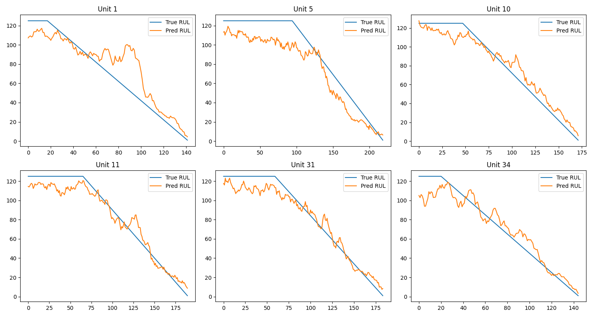

# Predictive Maintenance for aircraft engines

## Overview
This project focuses on **Remaining Useful Life (RUL) prediction** for aircraft engines using the NASA CMAPSS dataset.

Given multivariate time-series sensor data, the goal is to:
> predict how many cycles remain before engine failure.

The project implements a full **end-to-end machine learning pipeline**:
- data preprocessing
- feature engineering
- sequence generation
- LSTM-based modeling
- evaluation and visualization

---

## Business Impact

Predict engine failures before they occur, reducing maintenance costs and preventing unexpected downtime.

---

## Dataset

- Source: NASA CMAPSS (FD001 subset) <[link](https://www.kaggle.com/datasets/fareselgohary003/nasa-cmapss-turbofan-engine-rul-dataset?resource=download)>
- Multiple engines (units)
- Time-series data until failure (run-to-failure)

Each unit:
- starts healthy
- degrades over time
- ends at failure (last cycle)

Target:
- **RUL (Remaining Useful Life)** = cycles remaining before failure

---

## Pipeline

### 1. Data preprocessing
- Column naming and cleaning
- RUL computation: RUL = max_cycle - cycle
- Clipping of RUL (to stabilize training)

---

### 2. Feature Engineering

To improve signal quality:

- Rolling mean (trend)
- First-order difference (degradation speed)

This allows the model to capture:
- level
- trend
- dynamics

---

### 3. Sequence Generation

Time-series are transformed into sequences:

- Input: last `N` cycles (e.g. 30–50)
- Output: RUL at current time

---

### 4. Model

LSTM-based architecture:

- 2 LSTM layers
- Dropout regularization
- Dense regression head

---

### 5. Training

- Train/Validation/Test split by **unit**
- StandardScaler (fit on train only)
- Early stopping
- weighted loss to emphasize late-stage degradation

---

## Results

The model:
- captures degradation trends  
- detects failure phase  
- but tends to overestimate RUL in early life  

---

### Predictions

 

The figure shows predicted vs true RUL for multiple units. \
The model captures the degradation trend but tends to underestimate RUL in early life. The model struggles to estimate high RUL due to limited degradation signal in early cycles and target clipping.

---

### Performance

Test set results (FD001):

- **Mean MAE (per unit): 11.5 cycles**

This means that, on average, the model predicts the Remaining Useful Life of an engine within approximately 11 cycles.

The model captures degradation trends well, especially near failure, but tends to be less accurate during early life stages due to limited signal.

---

## Key Insights

- Early-stage degradation is difficult to detect due to weak signal  
- Feature engineering significantly improves performance  
- Sensor selection is important (many sensors are non-informative)  

---

## Tech Stack

- Python  
- Pandas / NumPy  
- Scikit-learn  
- TensorFlow / Keras  
- Matplotlib  

---

## How to Run

```bash
pip install -r requirements.txt
python src/train.py
